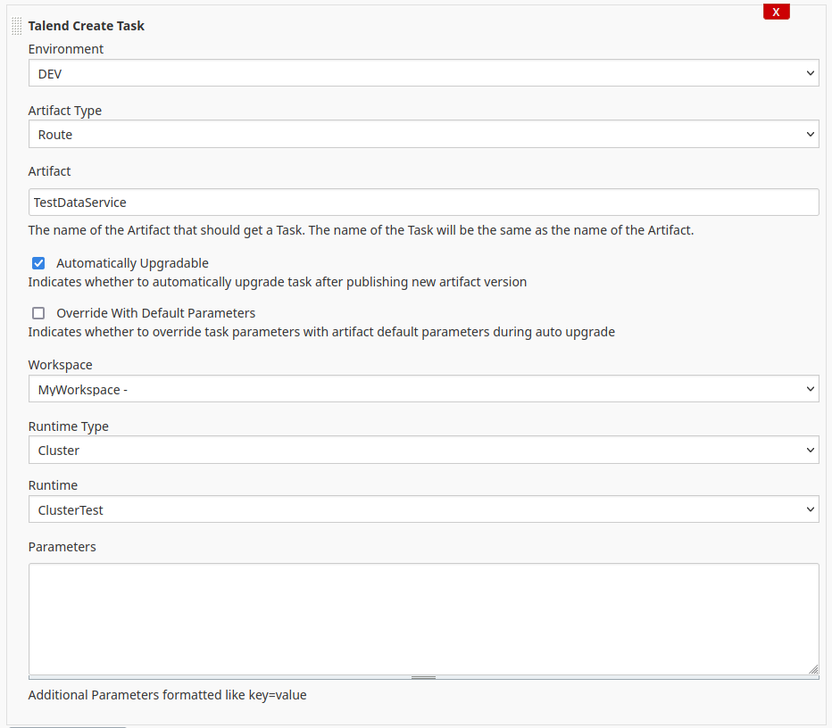

# talend

## Introduction

The Talend plugin connects your Jenkins to [Talend Cloud](https://cloud.talend.com). It supports the following actions:

- Create a Task
- Run a Task

## Getting started

After installation, first you must configure your connection to Talend Cloud. On the Configure System page of your Jenkins server,
add the Talend Cloud Personal Access Token and select the Talend Cloud Environment of your Talend Cloud instance.

There is only 1 access token for your whole Jenkins installation, so any Jenkins user that can create Builds or Pipelines can access
Talend Cloud with these credentials!

Now you are ready to create your first job.

### Create a Task

Create a Freestyle Job and add the build task "Create Talend Task". You can select the artifact that you want to base your task on 
by first selecting the Environment, then the Workspace and then the Artifact.

### Run a Task

Create a Freestyle Job and add the build task "Run Task". You can select the task by first selecting the 
Environment, then the Workspace and then the Task.

## Pipeline integration

The pipeline integration is not working yet.

## Contributing

If you want to contribute, please read the [contribution guidelines](CONTRIBUTING.md)

## LICENSE

Licensed under GPL-3.0-only, see [LICENSE](LICENSE.md)

